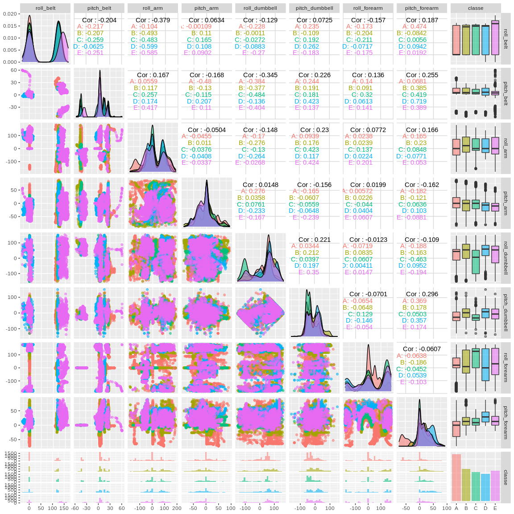
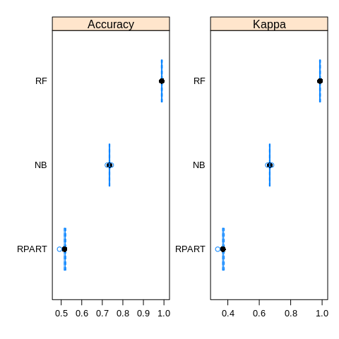
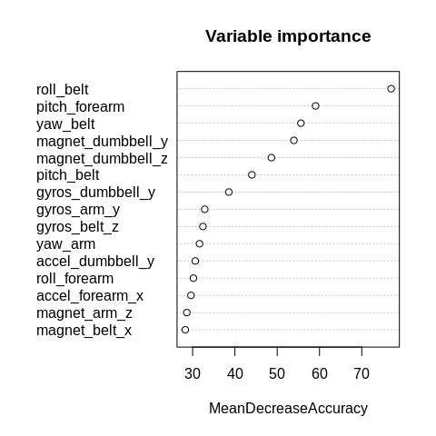

# Background

Using devices such as Jawbone Up, Nike FuelBand, and Fitbit it is now possible to collect a large amount of data about personal activity relatively inexpensively. These type of devices are part of the quantified self movement – a group of enthusiasts who take measurements about themselves regularly to improve their health, to find patterns in their behavior, or because they are tech geeks. One thing that people regularly do is quantify how much of a particular activity they do, but they rarely quantify how well they do it. In this project, your goal will be to use data from accelerometers on the belt, forearm, arm, and dumbell of 6 participants. They were asked to perform barbell lifts correctly and incorrectly in 5 different ways. More information is available from the website here: <http://web.archive.org/web/20161224072740/http:/groupware.les.inf.puc-rio.br/har>

The training data for this project are available here:

<https://d396qusza40orc.cloudfront.net/predmachlearn/pml-training.csv>

The test data are available here:

<https://d396qusza40orc.cloudfront.net/predmachlearn/pml-testing.csv>

The data for this project come from this source: <http://web.archive.org/web/20161224072740/http:/groupware.les.inf.puc-rio.br/har>. If you use the document you create for this class for any purpose please cite them as they have been very generous in allowing their data to be used for this kind of assignment [@cita].

# System Information and libraries

As no English native speaker, local configuration is changed to `en_US.UTF-8`:


In order to replicate or reproduce the analyses, system information is supplied:


1. Platform: x86_64-pc-linux-gnu
2. R version: R version 3.6.1 (2019-07-05)
3. Date: 2020-04-09

Finally, libraries used are also reported:


Table: Libraries loaded

                        Version 
----------------------  --------
caret                   6.0.86  
doParallel              1.0.15  
dplyr                   0.8.5   
GGally                  1.5.0   
ggplot2                 3.3.0   
httr                    1.4.1   
knitr                   1.28    
lubridate               1.7.4   
randomForest            4.6.14  
randomForestExplainer   0.10.0  
skimr                   2.1     

# Data

## Loading data

```r
GET("https://d396qusza40orc.cloudfront.net/predmachlearn/pml-training.csv", 
    write_disk(training <- tempfile(fileext = ".csv")))
```

```r
GET("https://d396qusza40orc.cloudfront.net/predmachlearn/pml-testing.csv", 
    write_disk(testing <- tempfile(fileext = ".csv")))
```

```r
training<-read.csv(training)
testing<-read.csv(testing)
```

## Cleaning data

First of all, some time was invested to review variables and to delete those which are not useful for modeling (nzv, NA variables, etc...). Skimr package can help us to visualize each variable `skim(training)`.


```r
#removing time, window, ... variables
training<-training[,-grep("user_name|*time*|*window*|X",names(training))]

#removing near zero variables
ind=nearZeroVar(training,saveMetrics = TRUE)
training<-training[,!(ind$nzv) & !(ind$zeroVar)]

#removing NA variables
NAratio<-function(x){sum(is.na(x))}
ind<-apply(training,2,NAratio)
training<-training[,which(ind<0.5*nrow(training))]

skim(training)
```

## Splitting data
Training data was split in two sets (training and validating) in order to evaluate the performance of the selected model over data not previously used for training. 


```r
set.seed(555)
inTrain<-createDataPartition(training$classe,p=0.6,list = FALSE)
training<-training[inTrain,]
validating<-training[-inTrain,]
```

## Reviewing data
`GGally` package help us to visualize the relation between predictors and response variable. It can be observed differences between `classe` factors for some variables which will be surely used in the modeling section.   

```r
ind<-grep("roll*|pitch*|classe",names(training))
ggpairs(training[,ind], aes(colour=classe, alpha=0.4)) 
```

<div class="figure" style="text-align: center">

<p class="caption">Visualizing variables.</p>
</div>

# Modeling

## Training and evaluating models

In order to obtain the best prediction over validating and testing data, three models were evaluated. Decision three, naive Bayes and random forest were selected. 


```r
cl<-makePSOCKcluster(3)
registerDoParallel(cl)

fitControl<-trainControl(method = "repeatedcv",number = 5, allowParallel = TRUE)


rpart_time<-system.time(
  modFit_rpart<-train(classe~.,data = training,method="rpart",
                      trControl=fitControl)
)

nb_time<-system.time(
  modFit_nb<-train(classe~.,data = training,method="nb",
                   trControl=fitControl)
)

rf_time<-system.time(
 modFit_rf<-train(classe~.,data = training,method="rf",ntree=300, metric="Accuracy",
                   trControl=fitControl,localImp = TRUE)
)

stopCluster(cl)
```


System time employed for every model training was recorded. Both naive Bayes (72.148 s) and random forest (303.907 s) modeling are high system time consuming.

To select the best model for our purpose, the `resample` function of the `caret` package was employed. How it is showed in the following figure, the random forest model, with an accuracy close to 1, is far better than naive Bayes and decision tree models. In the next section the accuracy of the selected model is evaluated over no used data. 


```r
models_compare<-resamples(list(RPART=modFit_rpart,NB=modFit_nb,RF=modFit_rf))
```


```r
scales <- list(x=list(relation="free"), y=list(relation="free"))
bwplot(models_compare, scales=scales)
```

<div class="figure" style="text-align: center">

<p class="caption">Model comparison</p>
</div>

Finally, the next figure shows the most important variables extracted from the random forest model built. For more advance information about the random forest model use the `randomForestExplainer` package (`explain_forest(modFit_rf$finalModel,interactions=FALSE,data=training)`).   


```r
varImpPlot(modFit_rf$finalModel,type=1, main="Variable importance",n.var=15)
```

<div class="figure" style="text-align: center">

<p class="caption">Variables sorted by importance for RF model</p>
</div>


## Validating the model selected {#validation}

As it can see in the next table, the random forest model gets an excellent accuracy over validating data, so it can be expected the same behavior over testing data (see table in results section). 


```r
CM<-as.matrix(confusionMatrix(validating$classe,predict(modFit_rf,validating)),what = "overall")
CM<-data.frame(Statistics=CM)
kable(CM,caption = "Accuracy of the RF model over validation data set")
```


Table: Accuracy of the RF model over validation data set

                  Statistics
---------------  -----------
Accuracy           1.0000000
Kappa              1.0000000
AccuracyLower      0.9992209
AccuracyUpper      1.0000000
AccuracyNull       0.2856539
AccuracyPValue     0.0000000
McnemarPValue            NaN

# Results over testing data

Finally, the random forest model is used to predict results over testing data set. Next table shows the results obtained. 


```r
testing$predict<-predict(modFit_rf,testing)
results<-as.data.frame(t(as.matrix(testing[,161])))
colnames(results)<-testing[,160]
kable(results,caption="Results",row.names=TRUE)
```


Table: Results

     1    2    3    4    5    6    7    8    9    10   11   12   13   14   15   16   17   18   19   20 
---  ---  ---  ---  ---  ---  ---  ---  ---  ---  ---  ---  ---  ---  ---  ---  ---  ---  ---  ---  ---
1    B    A    B    A    A    E    D    B    A    A    B    C    B    A    E    E    A    B    B    B  

# References


